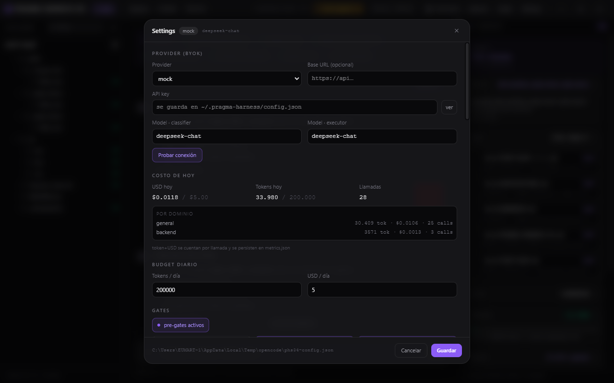

# Pragma Harness OS

**Harness Controls. Agent Executes.**

Control plane de escritorio (Electron) que envuelve a un agente LLM con un
**harness determinista**: clasifica cada tarea y compila reglas, skills, RAG y
archivos relevantes **antes** de despertar al modelo, y verifica el resultado
con gates **después**.



[](https://github.com/Eneye280/pragma_harness_os/actions/workflows/ci.yml)

## Por qué

Un agente "suelto" rediscoverya contexto cada turno, gasta tokens y pierde
retención. El harness lo resuelve compilando una sola vez lo que siempre debe
ir (G1–G10 + estilo + dominio + skills + RAG) y midiendo el **budget real** del
prompt final. El agente ejecuta; el harness decide con qué.

## Features

- **Pipeline determinista** — ingress → classify → plugins → rules → skills →
  RAG → context → pre-gates → plan → agent → tools → post-gates → merge.
- **Skills nativas** (`SKILL.md`) — `tdd-workflow`, `security-review`,
  `api-design`; editables sin recompilar.
- **Plugins por stages** — bloquear/transformar/inyectar antes o después del
  agente (`commit-guard`, `secret-scan`, `no-console-log`).
- **Gates pre/post** — secretos, budget, schema, build/typecheck/lint/tests.
- **Git worktree por tarea** — el agente nunca escribe en tu rama de trabajo.
- **BYOK** — `mock` (sin red), `deepseek`, `anthropic`, `openai`, `ollama`.
- **Memoria** — vault de instintos + "dreaming" al cerrar tareas.
- **A11y y teclado** — navegación completa sin mouse, focus traps, skip-link.
- **Distribución** — instalador NSIS + auto-update (GitHub Releases).

## Quickstart

```bash
# Requisitos: Node >= 20 y pnpm 9.12
pnpm install

pnpm dev                         # app en desarrollo (HMR)

pnpm quality-gate                # typecheck + tests + cobertura >= 80% del núcleo
pnpm --filter desktop test       # 262 tests
pnpm --filter desktop typecheck

pnpm --filter desktop icons      # regenera iconos
pnpm dist                        # instalador (NSIS win / dmg mac / AppImage linux)
```

Configura tu provider en **Settings** (`Ctrl/Cmd+,`). Sin API key, el harness
usa `mock` y todo el pipeline sigue siendo observable.

## Estructura

```
apps/desktop            Electron: main + preload + renderer (React 19 + Tailwind 4)
packages/harness-core   Contrato de eventos del harness
packages/harness-sdk    Interfaz pública de plugins
packages/ui-tokens      Tokens de diseño
skills/                 Skills nativas (SKILL.md)
apps/desktop/plugins/   Plugins (stages)
docs/                   HANDBOOK · ARCHITECTURE · PLUGIN-SDK
```

## Documentación

- **[docs/HANDBOOK.md](./docs/HANDBOOK.md)** — instalar, configurar provider,
  ejecutar tareas, crear skills y plugins, troubleshooting.
- **[docs/ARCHITECTURE.md](./docs/ARCHITECTURE.md)** — pipeline, persistencia,
  seguridad, testing/CI, ADR y **SPEC v1.0**.
- **[docs/PLUGIN-SDK.md](./docs/PLUGIN-SDK.md)** — un plugin en 10 líneas.

## Estado

**SPEC v1.0.2 (frozen).** Acumula v1.0.0 + v1.0.1 (workspace/perfiles, sesiones y reanudar,
adjuntos imagen/PDF/texto, plan editable con aprobación parcial, autoría de skills/plugins,
inspector RAG, grafo de dependencias, permisos por tool, sandbox, tools de verificación,
gate visual, routing/fallback, dashboard, health, feed privado, design system flotante,
ayuda + tour) y la expansión v1.0.2: hot-reload de plugins/skills/agentes, notificaciones
in-app, código resaltado en el chat, light/dark, settings por categorías, búsqueda web con
citas obligatorias, guardrail de cuelgue >10 min, cifrado de secretos (AES-256-GCM),
licencias y atribución, evidencia visual en el proyecto, auto-mejora, QA runner + perfiles
Unity, terceros (MCP/Supabase), multi-agente en paralelo y telemetría con gráficas.
Cambios de arquitectura requieren un ADR nuevo y bump de versión. Repo privado — acceso bajo invitación.
